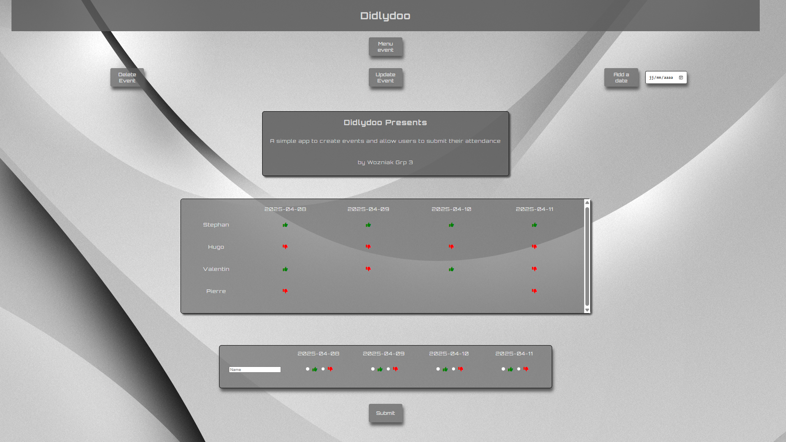

# Didlydoo | Group project for becode

## Feature

- Web app for create an event
- The users can be vote for the future dates of they are ok or no for assist at the event
- Possibilities to Add, Update, Delete, Add dates, create an attendance & vote for a dates

## Tech

- We using HTML and CSS for the frontend
- Javascript, Vite Environment for backend
- This page have responsive design

## Description

- Simple web app for create event and users add they attendances disponibilities

## Presents



## Structure

```
https://github.com/PatoucheH/didlydoo/
    ├─► README.md
    ├─► index.html
    ├─► package.json
    ├─► package-lock.json
    ├─► .gitignore
    ├─► backend/
    |   └─► ...
    |
    ├─► public/
    |   ├─► date-danniversaire.png
    |   └─► plus-symbole-noir.png
    |
    └─► src/
        ├─► CSS/
        |   ├─► styles.css
        |   ├─► responsive/
        |   |   ├─► responsive-event.css
        |   |   └─► responsive-index.css
        |   |
        |   └─► styles/
        |       ├─► style-event.css
        |       ├─► style-form.css
        |       └─► style-index.css
        |
        ├─► HTML/
        |     ├─► event.html
        |     └─► form.html
        |
        └─► javascript/
            ├─► index.js
            ├─► form.js
            ├─► event.js
            ├─► event-function/
            |       ├─► attendance-form-event.js
            |       ├─► create-body-tabel.js
            |       ├─► create-form-attendances.js
            |       ├─► create-header-tabel.js
            |       ├─► create-input.js
            |       ├─► delete-event.js
            |       ├─► display-one-event.js
            |       └─► modify-event.js
            |
            ├─► form-function/
            |       ├─► get-input-value.js
            |       ├─► post-new-event.js
            |       ├─► create-event-or-display-error.js
            |       └─► display-error.js
            |
            ├─► general-utils/
            |       ├─► add-dates.js
            |       ├─► get-dates.js
            |       ├─► get-json-info.js
            |       └─► header.js
            |
            └─► index-function/
                    ├─► best-possible-date.js
                    └─► get-all-infos.js

```

# Credit

- **Please! Do not modify this repository.**
- Created by Valentin Hugo & Stephan
